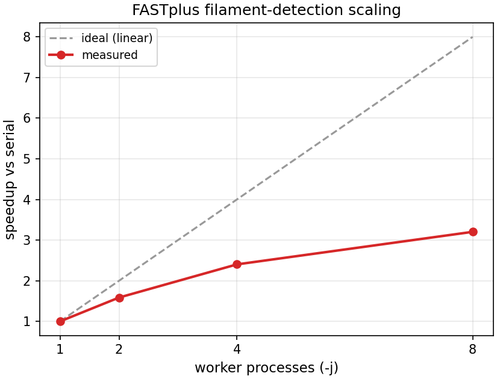

# FASTplus — parallel filament detection: verification

Verification that parallelizing per-frame filament detection in the FASTplus
directional pipeline (`fastplus`) is **numerically identical** to the serial
path. Supporting evidence for the parallelism change on branch
`fastplus-directional`.

## What changed

Per-frame filament detection — the dominant cost in the directional pipeline —
is now mapped over `nprocs` worker processes via a `multiprocessing.Pool`
(`_pmap` + the picklable worker `_detect_one_frame` in
`pipelines/directional.py`), mirroring `pipelines/gliding`. Workers return
lightweight, picklable `FilamentRecord`s; head tracking and per-frame averaging
remain on the parent process (they require global frame order). Selected with
`-j` / `nprocs` (`None` → all cores, `1` → serial). See the design note in
`DESIGN_NOTES.md` (§6) for the rationale.

The key correctness requirement: **results must not depend on worker count.**

## Method

The same dataset was analyzed twice — serial (`-j 1`) and parallel (all cores) —
into separate output folders, then compared.

```bash
# serial
fastplus -d ".../PolarityLabeled/20170803/ch12" --mode head-centric \
    --head-channel red --head-quality 8 --no-register --spf 0.1356 \
    --kinetic-model exp_rise_decay -j 1 --output ch12_serial -v

# parallel (all cores)
fastplus -d ".../PolarityLabeled/20170803/ch12" --mode head-centric \
    --head-channel red --head-quality 8 --no-register --spf 0.1356 \
    --kinetic-model exp_rise_decay --output ch12_par -v
```

Dataset: `MyLOVChar/PolarityLabeled/20170803/ch12` — 2 polarity-labelled movies,
800 frames each (205×492 / 212×491), entropy filament detector, head channel =
red, 135.6 ms/frame, single LED on/off cycle (switch frames 98 → 298).

## Results — outputs are byte-for-byte identical

| Output artifact | Serial vs parallel |
|---|---|
| `frame_average.csv` (800 rows) | **identical** (byte-for-byte) |
| `kinetics.txt` | **identical** (byte-for-byte) |
| `directional_paths.csv` (movie 01) | **identical** (byte-for-byte) |
| `directional_paths.csv` (movie 03) | **identical** (byte-for-byte) |
| `frame_average.png` | **identical** bytes (226,492 B); decoded pixels equal (825×1500×4) |

File sets in the two output directories are also identical.

### Fit result (both runs)

```
FASTplus continuous piecewise kinetic fit
classifications: {'plus_end': 10534, 'none': 23158, 'both_ends': 319, 'middle': 1086}
dark baseline A0 = 3579 nm/s   overall R2 = 0.327

cycle  kind    tau(s)   start(nm/s)  level(nm/s)   t0(s)
0      rise     0.761        3579.0       4572.6    13.29
1      decay   30.1          4572.6       3437.3    40.41
```

## Conclusion

Parallelization is deterministic and side-effect-free: serial and all-core runs
produce identical CSVs, identical kinetic fits, and pixel-identical plots. The
change is safe to merge to `main`.

### Determinism notes

- Per-frame detection is independent and order-preserving (`Pool.imap`), so
  worker count cannot affect results.
- Head tracking, association/disambiguation, per-frame averaging, and fitting
  run on the parent process exactly as before.
- A failing frame is caught per-worker (warns, yields no filaments) rather than
  aborting the run.

## Timing benchmark

A benchmark script times the directional run across worker counts and reports
speedup / efficiency (and can re-verify determinism per run):
`tools/benchmark_fastplus_parallel.py`.

```bash
python tools/benchmark_fastplus_parallel.py \
    -d ".../PolarityLabeled/20170803/ch12" \
    --jobs 1 2 4 8 --repeats 2 --spf 0.1356 --head-quality 8 \
    --no-register --verify
```

It runs each `-j` into a temporary output dir, reports the minimum wall-clock
time over `--repeats`, and writes `benchmark_parallel_results.md` + `.csv` + a
speedup plot. Use `--max-frames` to shorten the benchmark. Speedup =
`t(j=1) / t(j)`; efficiency = `speedup / j`.

### Results

Dataset: `MyLOVChar/PolarityLabeled/20170803/ch12` (2 movies × 800 frames),
entropy detector, `--spf 0.1356 --head-quality 8 --no-register`, `--repeats 2`
(minimum reported); macOS, `fastrack-ridge` conda env.

| jobs | time (s) | speedup | efficiency | verify |
|------|----------|---------|------------|--------|
| 1    | 66.3     | 1.00×   | 100%       | OK     |
| 2    | 41.8     | 1.58×   | 79%        | OK     |
| 4    | 27.6     | 2.40×   | 60%        | OK     |
| 8    | 20.7     | 3.20×   | 40%        | OK     |



`verify=OK` at every worker count confirms each parallel run reproduced the
serial `frame_average.csv` byte-for-byte.

### Interpretation

Solid speedup (3.2× on 8 workers) with the expected tapering: efficiency falls
from 79% (2 workers) to 40% (8). That is consistent with Amdahl's law — the
serial remainder (per-movie load/split, head detection + Kalman tracking,
per-frame averaging, fitting, plotting) and the `spawn` worker-startup cost are
not parallelized, so they cap the achievable speedup. The 8-core run likely also
overlaps logical cores. Larger jobs (more movies / frames) amortize startup and
push efficiency up; if detection ever needs to scale further, across-movie
parallelism (noted in `DESIGN_NOTES.md` §6) is the next lever.
